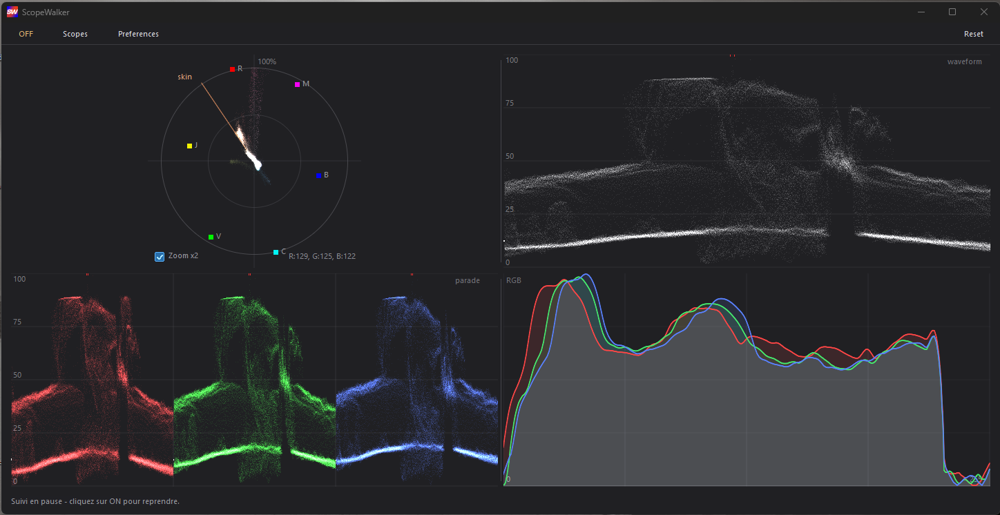
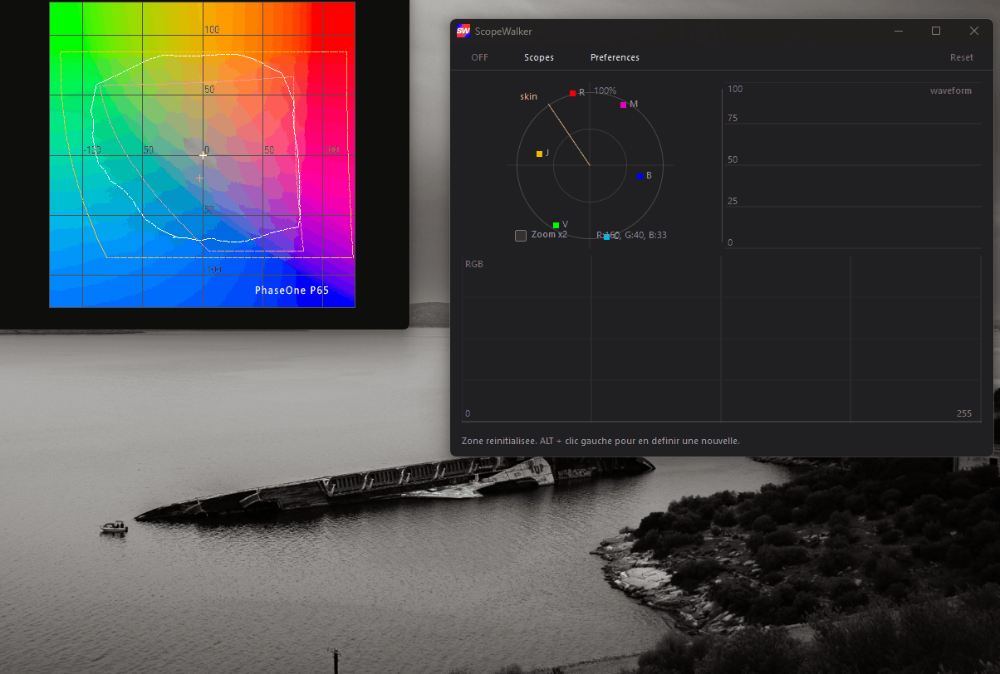

# ScopeWalker 👋

**Free multiscopes for any photo or video editor on Windows.**

Every scope solution out there is expensive, and Adobe still won't add proper scopes to Photoshop or Lightroom. So I built this small tool: a **vectorscope, waveform, RGB parade and histogram** that work on top of *any* software — Photoshop, Lightroom, Capture One, DaVinci Resolve, or literally anything else on your screen.



---

## Download

Grab the latest `scopewalker.exe` from the [**Releases**](https://github.com/ScopeWalker/ScopeWalker/releases/latest) page — no installation, no dependencies, a single standalone executable.

---

## How it works

1. Download and run `scopewalker.exe` — no installation, no dependencies.
2. Hold **Alt** and drag a square over the area of the screen you want to analyse.
3. That's it. The scopes update in real time as you edit.

The selection frame stays on top of every other window, so you can keep working in your editor and watch your colors at the same time.



---

## Features

- **Vectorscope** — with skin tone line, R/Y/G/C/B/M targets at their true positions, and a 2× zoom for low-saturation work.
- **Waveform** — luma (white) or RGB mode.
- **RGB Parade** — the classic three-panel view.
- **RGB Histogram** — smoothed, with Lightroom-style curves per channel.
- **Clipping indicator** — pure white shows as a red bar on top, pure black as a blue bar at the bottom.
- **RGB at cursor** — live readout of the pixel under your mouse.
- **Live tracking** — the scopes refresh automatically, but only when something actually changes in the selected area (so it stays light on CPU).
- **Split scopes** — pop each scope into its own window and arrange your workspace however you like.
- **Customizable** — change the modifier key, the pause key, the frame color, and the brightness of the point cloud.

---

## Shortcuts

| Action | Default |
|---|---|
| Select an area | **Alt** + left click & drag |
| Pause / resume tracking | **Esc** |
| Stop tracking without losing the area | **ON/OFF** button |
| Clear the area | **Reset** |

The modifier and pause keys can be changed in **Preferences**.

---

## Requirements

Windows 10 or 11 (64-bit). Nothing else — it's a single standalone `.exe` written in plain C with the Win32 API.

---

## Build from source

The portable drawing core lives in [`src/core/`](src/core/) (no Win32 dependency); the Windows shell is [`src/scopewalker.c`](src/scopewalker.c). It links against `gdi32`, `user32`, `dwmapi` and `advapi32` — no third-party dependencies.

### MSVC (Developer Command Prompt)

```bat
cl /O2 src\scopewalker.c src\core\draw.c /link gdi32.lib user32.lib dwmapi.lib advapi32.lib /subsystem:windows /out:scopewalker.exe
```

Verified with the Visual Studio 2019 Build Tools (x64).

### MinGW-w64 (GCC)

```sh
gcc -O2 -mwindows src/scopewalker.c src/core/draw.c -o scopewalker.exe -lgdi32 -luser32 -ldwmapi -ladvapi32
```

> `-mwindows` builds a GUI app (no console window). Drop it if you want a console for debugging.

---

## "Unknown publisher" warning ⚠️

The first time you run it, Windows may show a blue SmartScreen box saying **"Windows protected your PC — unknown publisher"**.

This is normal and doesn't mean anything is wrong with the app. Windows shows this for *any* program that isn't signed with a paid code-signing certificate (they cost a few hundred euros a year, and this is a free tool).

To run it anyway:

1. Click **More info**
2. Click **Run anyway**

You only need to do this once. If you'd rather check for yourself first, the full source code is in this repo — feel free to read it, or compile it yourself.

---

## Support the project

If you make a video or any content using ScopeWalker, please tag my Instagram [**@paul_bchz**](https://instagram.com/paul_bchz) and my website [**lightwalker.fr**](https://lightwalker.fr/) — it would help me a lot. 🙏

---

## License

Released under [CC0 1.0](LICENSE) — free to use. If you fork it or build on it, a credit is always appreciated.
